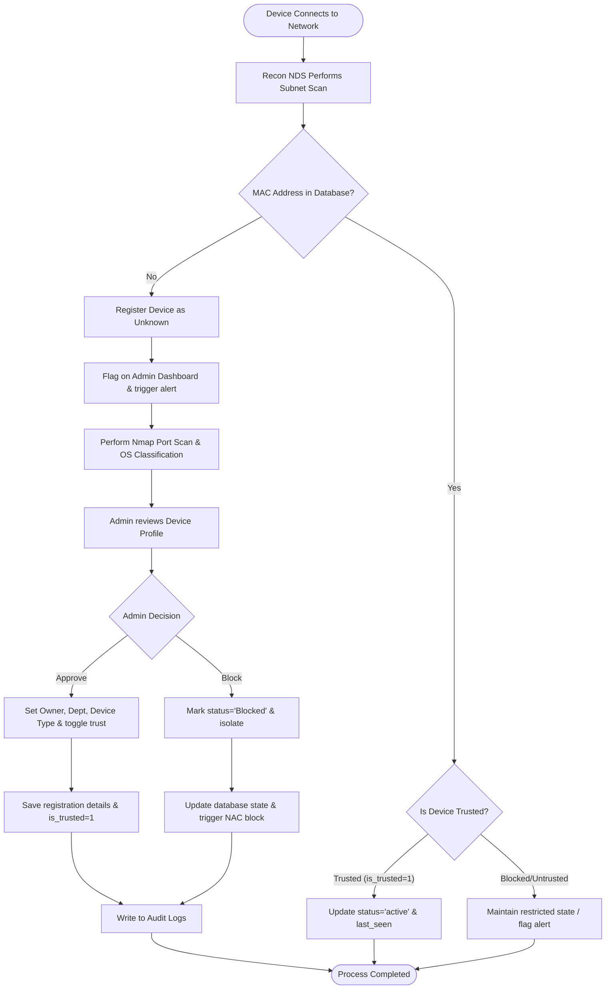
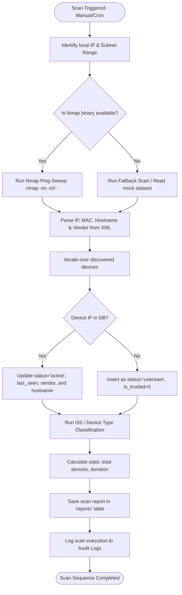
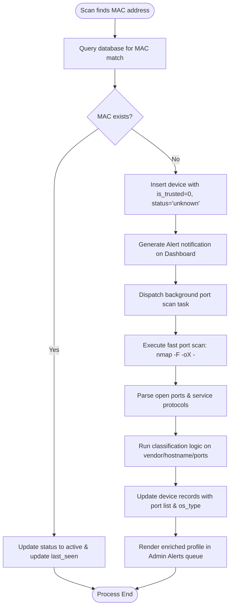
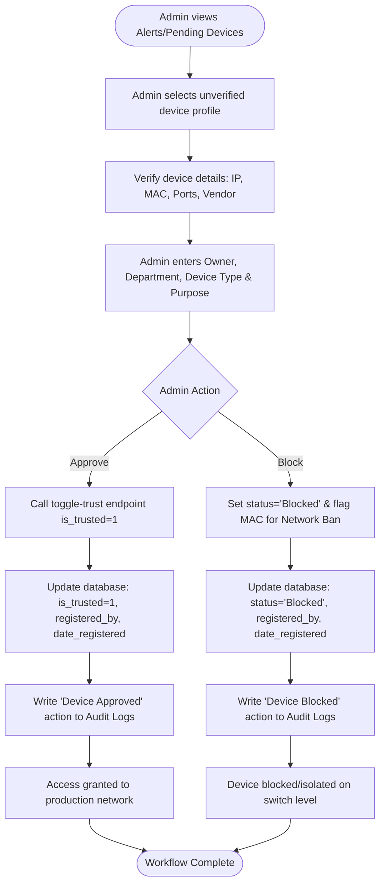
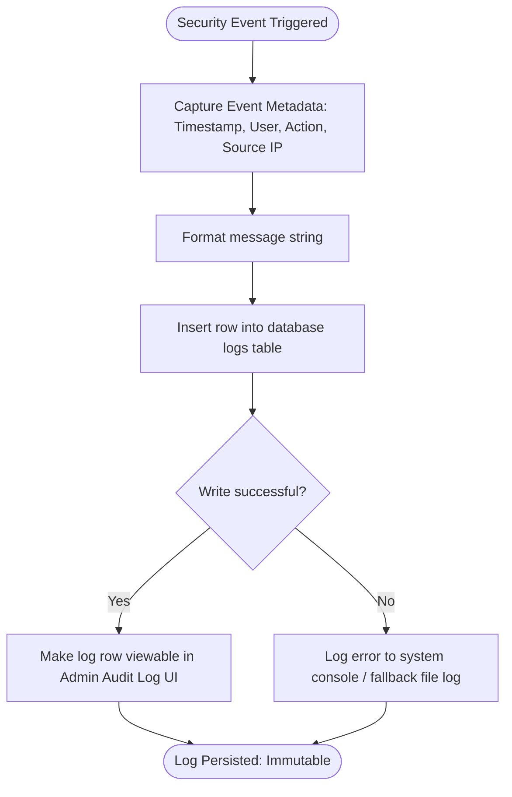
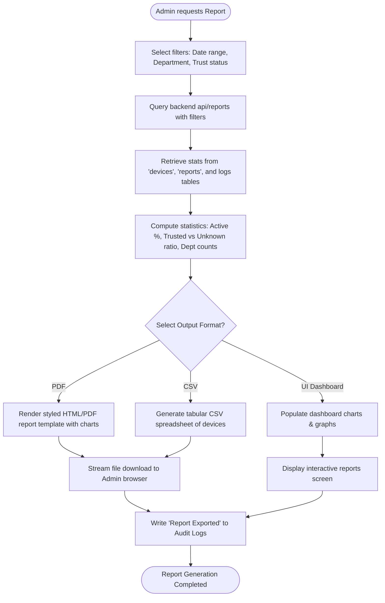

# Recon NDS System Flow Specifications

This document outlines the detailed system flows, decision points, data schemas, and role permissions for **Recon NDS** (Network Device Scanner) by **Recon Network Systems Inc.**, a Network Device Identity and Tracking System.

---

## 1. Complete System Flow (Device Connection to Approval)

This flow illustrates the lifecycle of a physical device from the moment it connects to the network to when it is discovered, processed, and approved or blocked by an administrator.

### Step-by-Step Flow
1. **Device Connection:** A device connects to the physical or wireless network, triggering DHCP request, ARP broadcasts, or normal IP traffic.
2. **Network Scan:** Recon NDS runs a network sweep (manual or scheduled background task).
3. **Device Discovery:** The scanner detects the IP/MAC address.
4. **Database Verification:** System checks if the MAC address exists in the database.
   - **Scenario A: Existing & Trusted (`is_trusted = 1`):** System updates its state to active, logs `last_seen`, and maintains normal tracking.
   - **Scenario B: Existing & Blocked:** Device remains isolated/blocked.
   - **Scenario C: Unknown MAC:** System creates a new device profile, flags it as `Unknown`, triggers alerts, and queues a port scan.
5. **Admin Alerting:** The dashboard displays the new device under the Alerts panel.
6. **Device Profiling:** Admin reviews the MAC, vendor, hostname, open ports, and inferred OS type.
7. **Identity Verification:** Admin associates the device with a user, department, and purpose.
8. **Admin Approval Action:** Admin approves (toggles trust to `1`) or blocks the device.
9. **State Transition & Auditing:** The database updates the device profile (updates `is_trusted` and logs `registered_by` and `date_registered`), and registers an audit log entry.

### Flowchart



---

## 2. Login and Authentication Flow

This flow defines how users authenticate, how their access token is generated, and how their user role (Super Admin, IT Admin, Staff) restricts dashboard views and API access.

### Step-by-Step Flow
1. **Request:** User enters username and password in the frontend panel.
2. **Authentication:** Backend matches credentials and checks if the account `is_active = 1`.
3. **Token Issuance:** If valid, the system issues a secure session token/JWT containing the user's role.
4. **Role Classification:** The system matches the user's role:
   - **Super Admin:** Granted full dashboard access (users management, settings, scan execution, and full trust toggle capabilities).
   - **IT Admin:** Granted access to view all devices, trigger scans, edit device profiles, and toggle trust status.
   - **Staff:** Granted read-only view restricted *only* to devices where `Owner Name` matches the authenticated username.
5. **Dashboard Redirect:** The frontend routes the user to the designated view.
6. **Log Event:** A successful login event is saved to the audit log.

### Flowchart

```mermaid
graph TD
    A([User inputs credentials]) --> B[Backend queries 'users' table]
    B --> C{Credentials Valid & is_active=1?}
    
    C -- No --> D[Return 401 Unauthorized / Show Error]
    C -- Yes --> E[Generate session token with Role]
    
    E --> F{User Role?}
    F -- Super Admin --> G[Redirect to Super Admin Dashboard]
    F -- IT Admin --> H[Redirect to IT Admin Dashboard]
    F -- Staff --> I[Redirect to Staff View (Filtered by Owner)]
    
    G --> J[Enable Device CRUD, User Management, Scan Trigger, Trust Toggles]
    H --> K[Enable Device Views, Scan Trigger, Trust Toggles]
    I --> L[Enable Read-only list of owned devices]
    
    J --> M[Log login event in Audit Logs]
    K --> M
    I --> M
    M --> N([Dashboard Session Active])
```

---

## 3. Network Scan Flow

This flow describes the background operation of the network scanner, from triggering to scanning, parsing, database upserting, and report logging.

### Step-by-Step Flow
1. **Trigger:** The scan starts via a scheduled cron scheduler or an Admin clicking the manual trigger button (`POST /api/devices/scan`).
2. **Subnet Discovery:** The system retrieves the local IP and deduces the subnet range (e.g., `192.168.1.0/24`).
3. **Execution:** The scanner executes an Nmap ping sweep (`nmap -sn -oX - <range>`). If Nmap fails due to permissions, it falls back to a ping sweep or mock baseline scan.
4. **Parsing:** The XML output is parsed to extract active IP addresses, MAC addresses, hostnames, and manufacturer vendors.
5. **Device Upsert:** For each discovered device:
   - **If IP exists:** The system updates MAC, hostname, vendor, status (to `'active'`), and `last_seen`. The `is_trusted` status is preserved.
   - **If IP is new:** The system inserts the device with status = `'active'`, and defaults `is_trusted = 0` (Untrusted/Pending).
6. **Device Type Classification:** Inferred using open ports, hostname keywords, and vendor strings.
7. **Report Compilation:** The system calculates duration and active device count, inserting a new entry into the `reports` table.
8. **Logging:** The scanner logs the scan completion to the audit logs.

### Flowchart



---

## 4. Unknown Device Detection Flow

This flow illustrates the automated security triggers that fire the moment a never-before-seen MAC address is picked up by a network scan.

### Step-by-Step Flow
1. **Discovery:** The Network scan discovers a device MAC address not present in the database.
2. **Database Insertion:** The device is recorded with status = `'unknown'` and `is_trusted = 0`.
3. **Alert Trigger:** The system generates an immediate UI notification/alert flag on the Admin Dashboard.
4. **Asynchronous Enrichment:** The backend dispatches an asynchronous task to run a port scan (`POST /api/devices/{id}/scan-ports`) targeting the device's IP.
5. **Port Profiling:** The Nmap fast port scan scans the top 100 ports, returning services (e.g. HTTP, SSH, SMB, Printing).
6. **Classification Upgrade:** The system runs classification heuristics:
   - Port 631/9100 open $\rightarrow$ `printer`
   - Port 53/161 open $\rightarrow$ `router`
   - Cisco/Ubiquiti vendor $\rightarrow$ `router`
   - Dell/Supermicro vendor or Port 22 open $\rightarrow$ `server`
7. **Admin Notification:** Detailed profile with open ports and classification is presented to admins for immediate action.

### Flowchart



---

## 5. Admin Approval Workflow

This flow explains the decision-making dashboard panel where administrators review alerts, assign device metadata, and update the device trust level.

### Step-by-Step Flow
1. **Navigation:** Admin opens the Dashboard and views the "Alerts / Pending Devices" list.
2. **Selection:** Admin selects an unverified device profile to review details.
3. **Data Verification:** Admin confirms physical ownership of the device.
4. **Metadata Input:** Admin inputs the Device Profile parameters:
   - **Device Name** (Hostname adjustment)
   - **Device Type** (Laptop, Phone, Printer, Router, etc.)
   - **Owner Name** (Assign to a staff member)
   - **Department** (IT, HR, Finance, Admin)
   - **Purpose** (e.g., "Development Testing", "Office Printing")
5. **Trust Toggle Action:** Admin makes a decision:
   - **Approve:** Toggles trust (`POST /api/devices/{device_id}/toggle-trust` $\rightarrow$ `is_trusted = 1`).
   - **Block:** Sets status = `'Blocked'` and registers MAC to the NAC (Network Access Control) blocklist.
6. **Record Update:** Database saves registration metadata:
   - `registered_by` $\rightarrow$ Username of active Admin session.
   - `date_registered` $\rightarrow$ Current timestamp.
7. **Audit Logging:** Logs the administrative operation.

### Flowchart



---

## 6. Audit Log Flow

This flow illustrates the system-wide logging mechanism that records security-sensitive operations, ensuring traceability and accountability.

### Step-by-Step Flow
1. **Event Trigger:** An action occurs in Recon NDS (e.g., User login, Scan execution, Trust toggle, Device deletion).
2. **Context Collection:** The logger function gathers metadata:
   - Timestamp (UTC/Local)
   - Initiator User ID & User Role
   - Action Category (e.g., AUTH, SCAN, POLICY, REGISTER)
   - Target Entity ID (e.g., Device ID, User ID)
   - Action Description (e.g., "Admin toggled trust on device AA:BB:CC:DD:EE:FF")
   - Source IP address of the request
3. **Database Write:** The log entry is written to the immutable logs table.
4. **Log Retention:** Log records are read-only and cannot be updated or deleted by any user role, maintaining a clean audit trail.
5. **Dashboard Viewer:** Admins can view and search logs via the audit settings view.

### Flowchart



---

## 7. Report Generation Flow

This flow covers how the system aggregates network scanning metrics and device profiles into downloadable reports for security audits.

### Step-by-Step Flow
1. **Request:** Admin selects report parameters (Date Range, Trust Levels, Department filter).
2. **Trigger:** Admin clicks "Generate Report" (`GET /api/reports`).
3. **Aggregation:** Backend queries the databases (`devices`, `reports`, and log tables) to extract:
   - Total connected devices
   - Device status ratio (Active/Inactive)
   - Trust status ratio (Trusted, Pending, Blocked, Unknown)
   - Department allocations (Devices per Dept)
   - Timeline of scan events and detected alerts
4. **Formatting:** The system converts the raw JSON query results:
   - **CSV Export:** Aggregated table view.
   - **PDF Export:** Styled template with metadata and charts.
   - **UI Dashboard:** Interactive widgets and charts.
5. **Serving:** The user downloads the file or views the report.
6. **Auditing:** The system registers "Report generated by [User]" in the audit log.

### Flowchart



---

## Device Profile Data Model (Reference Schema)

```sql
CREATE TABLE devices (
    id INTEGER PRIMARY KEY AUTOINCREMENT,
    ip TEXT UNIQUE NOT NULL,                  -- IP Address
    mac TEXT,                                 -- MAC Address
    hostname TEXT,                            -- Device Name / Hostname
    vendor TEXT,                              -- Device Manufacturer/Vendor
    status TEXT DEFAULT 'unknown',            -- Status (active, inactive, blocked, unknown)
    open_ports TEXT,                          -- JSON array of open ports (e.g. [{"port": 80, "service": "http"}])
    os_type TEXT DEFAULT 'generic',           -- Device Type (laptop, phone, printer, router, server)
    is_trusted INTEGER DEFAULT 0,             -- Trust Level: 0 = Unknown/Pending/Blocked, 1 = Trusted
    registered_by TEXT,                       -- Admin/IT Admin Username who registered the device
    date_registered TIMESTAMP,                 -- Date Approved/Registered
    last_seen TIMESTAMP DEFAULT CURRENT_TIMESTAMP
);
```
